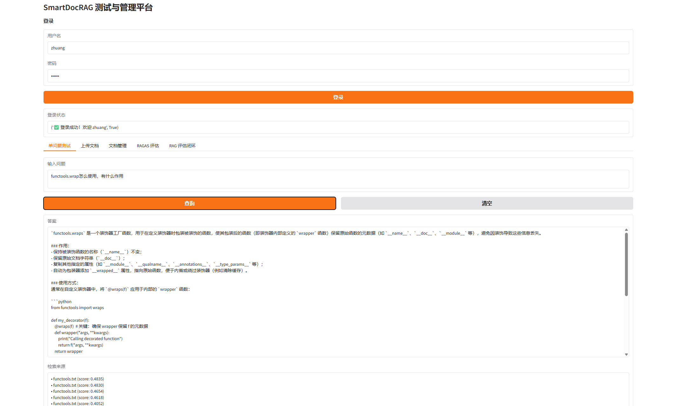
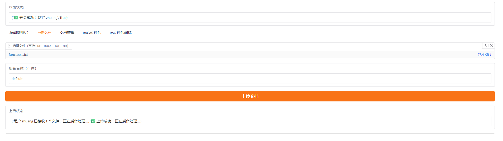
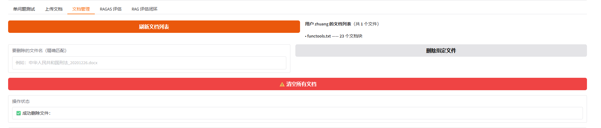
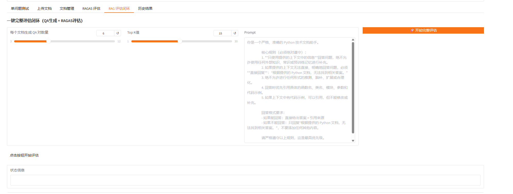
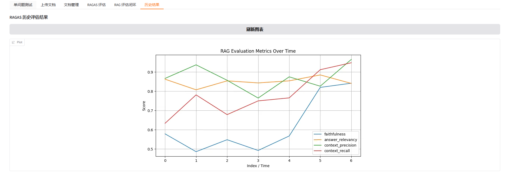

# SmartDocRAG

生产级智能文档 RAG 问答系统

基于 FastAPI + LlamaIndex + PostgreSQL pgvector 构建，支持 PDF/Word/Markdown 等文档上传、异步处理、向量检索与智能问答。

## 特性
- 异步文档摄入管道（Celery + Redis）
- 用户隔离索引（多租户支持）
- Hybrid Search + 重排序
- JWT 认证与 API 限流
- RAGAS 评估框架
- Docker 一键部署

## 技术栈
- **后端**：FastAPI (Python 3.12)
- **RAG 框架**：LlamaIndex
- **向量数据库**：PostgreSQL + pgvector
- **嵌入模型**：BGE-M3
- **LLM**：Grok / Qwen / DeepSeek (OpenAI 兼容接口)
- **任务队列**：Celery + Redis

## 🎯 Frontend Overview (Gradio UI)

本项目基于 **Gradio** 构建了一套完整的 RAG 系统交互界面，覆盖从文档接入 → 检索问答 → 效果评估 → 可视化分析的完整闭环。

界面共包含 5 个核心功能模块：

---

### 1️⃣ 问题测试（Query Testing）

用于验证 RAG 系统的实际问答效果，是最核心的交互入口。

<!-- 在这里替换为你的截图 -->

**功能说明：**
- 输入用户问题，触发 RAG 检索 + LLM 生成
- 返回最终答案（Answer）
- 可扩展展示：
  - 检索到的上下文（Context）
  - 相似度 / Top-K 文档
- 支持快速迭代 Prompt 和检索策略

**适用场景：**
- 验证知识库是否生效
- 调试召回质量（recall）
- 观察 hallucination（幻觉）情况

---

### 2️⃣ 上传文档（Document Upload）

用于构建知识库的数据入口。

<!-- 在这里替换为你的截图 -->

**功能说明：**
- 支持上传本地文档（如 PDF / TXT / Markdown 等）
- 自动进行：
  - 文档解析（Parsing）
  - Chunk 切分
  - 向量化（Embedding）
  - 写入向量数据库（如 pgvector）
- 上传后立即可用于 RAG 检索

**特点：**
- 简化数据接入流程
- 支持快速构建私有知识库

---

### 3️⃣ 文档管理（Document Management）

用于对已上传文档进行管理与维护。

<!-- 在这里替换为你的截图 -->

**功能说明：**
- 查看当前知识库中的文档列表
- 支持删除指定文档
- 可扩展：
  - 文档分块预览
  - 向量数量统计
  - 文档元信息（metadata）查看

**设计目标：**
- 提供基本的数据治理能力
- 避免“黑盒式”知识库

---

### 4️⃣ RAGAS 评估（RAG Evaluation）

基于 **RAGAS** 对系统进行自动化评估。

<!-- 在这里替换为你的截图 -->

**支持指标：**
- **Faithfulness（忠诚度）**：答案是否忠于上下文  
- **Answer Relevancy（答案相关性）**：是否回答了问题  
- **Context Precision（上下文精确度）**：检索内容是否精准  
- **Context Recall（上下文召回率）**：是否召回足够信息  

**功能说明：**
- 自动执行评估流程（基于 QA 数据集）
- 输出结构化评估结果
- 支持结果持久化（CSV）

**使用价值：**
- 定量评估 RAG 系统效果
- 对比不同策略（embedding / retriever / prompt）

---

### 5️⃣ 图表展示（Metrics Visualization）

用于展示 RAG 评估结果的历史变化趋势。

<!-- 在这里替换为你的截图 -->

**功能说明：**
- 基于历史 CSV 数据生成可视化图表
- 四项核心指标统一展示在一张图中
- 使用多折线对比：
  - Faithfulness
  - Answer Relevancy
  - Context Precision
  - Context Recall

**优势：**
- 直观观察模型优化效果
- 快速发现性能波动
- 支持持续评估（Evaluation Tracking）

---

## 📊 Summary
> **RAG 系统实验与评估平台（RAG Experiment & Evaluation Dashboard）**

覆盖：
- 数据接入（Upload）
- 系统验证（Query）
- 数据管理（Management）
- 自动评估（RAGAS）
- 可视化分析（Visualization）